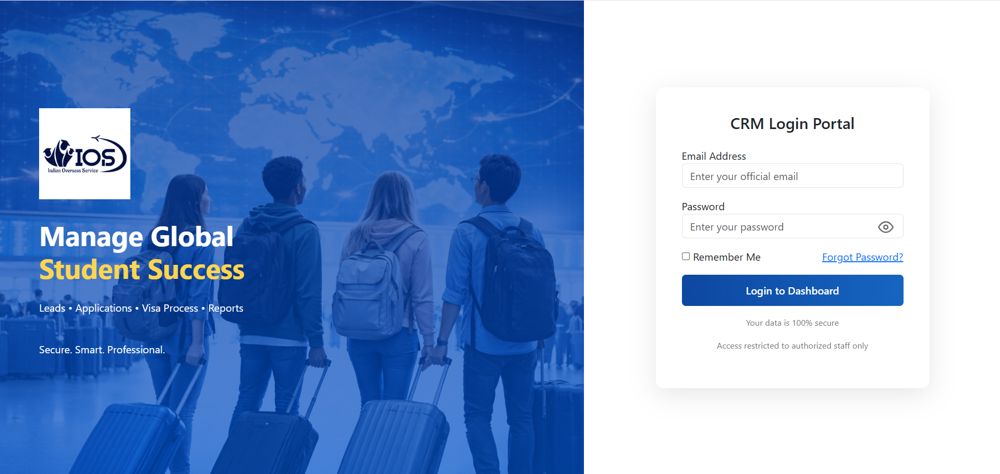
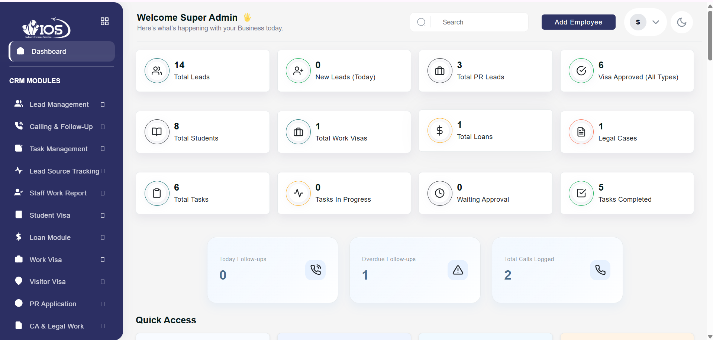
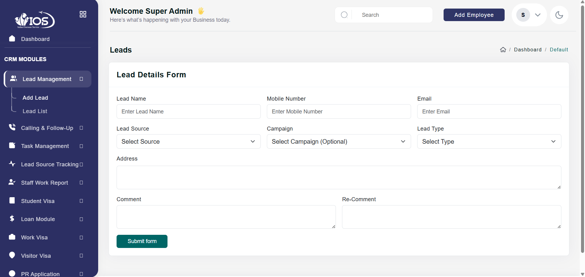
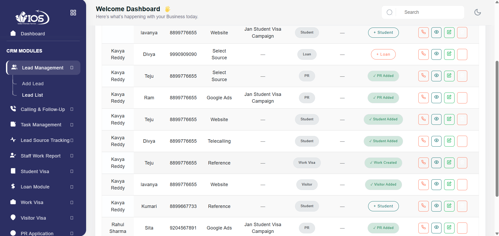
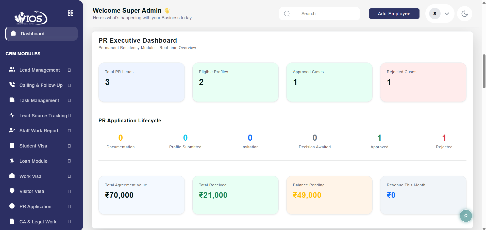
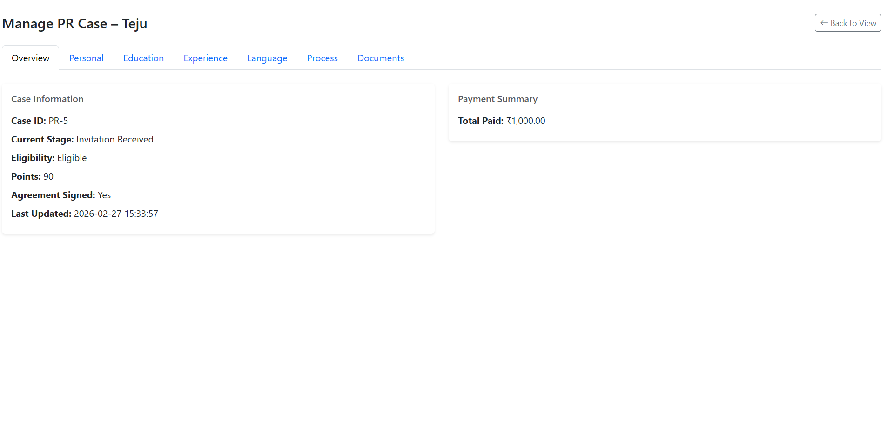
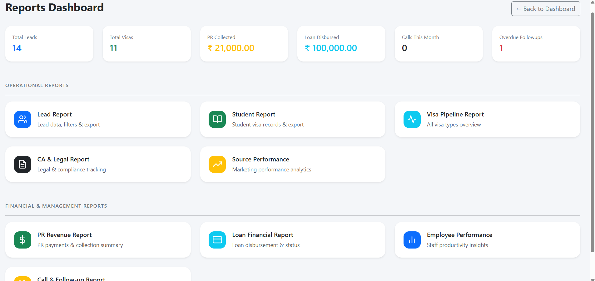
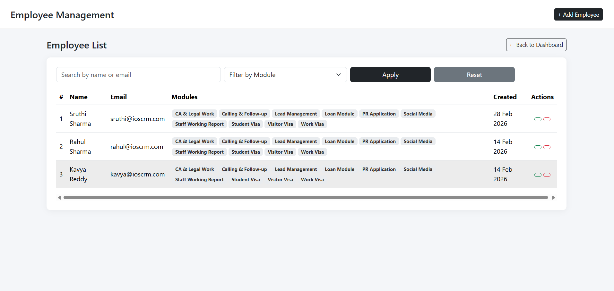

# Lead Management CRM Project

## Project Overview

The **Lead Management CRM System** is a customized web-based Customer Relationship Management (CRM) application developed using **PHP** and **MySQL** for a **freelance client**.

The system was designed to streamline lead tracking, employee management, task assignments, visa processing, customer follow-ups, reporting, and business operations through a centralized platform.

Built on the **Riho Admin Template (Pixelstrap)**, the project includes custom backend development, database design, authentication, role-based access control, dashboards, reporting, and multiple business modules developed according to the client's workflow and requirements.

## Project Information

|      Item          |             Details                         |
|--------------------|---------------------------------------------|
| **Project Type**   | Freelance Client Project                    |
| **Category**       | Web-based Lead Management CRM System        |
| **Purpose**        | Business Process Automation & CRM           |
| **Architecture**   | Multi-module CRM Application                |
| **Admin Template** | Riho Admin Template (Pixelstrap)            |
| **Backend**        | PHP                                         |
| **Database**       | MySQL                                       |
| **Frontend**       | HTML, CSS, JavaScript, Bootstrap            |
| **Authentication** | Role-Based Access Control                   |
| **Development**    | Customized according to client requirements |

## Core Modules

### Dashboard & Analytics
- Admin Dashboard
- Employee Dashboard
- Business Overview Dashboard
- Real-time KPI Cards
- Quick Access Panel
- Business Statistics & Analytics

### Employee Management
- Add, View, Edit & Delete Employees
- Employee Access & Module Permissions
- Employee Directory
- Staff Performance Tracking

### Lead Management
- Lead Registration
- Lead Listing
- Lead Details View
- Lead Editing
- Lead Source Tracking
- Lead Status Management

### Calling & Follow-up
- Call Logging
- Follow-up Tracking
- Call History
- Pending & Overdue Follow-ups

### Task Management
- Task Assignment
- Employee Task Tracking
- Task Status Updates
- Task Reports

### Student Visa Module
- Student Profile Management
- Application Tracking
- Visa Pipeline Dashboard

### Work Visa Module
- Work Visa Management
- Application Tracking

### Visitor Visa Module
- Visitor Visa Records
- Approval Status Tracking

### Permanent Residency (PR) Module
- PR Profile Management
- Multi-step PR Case Management
- Eligibility Tracking
- Document Management
- Payment Tracking
- Application Lifecycle Management
- PR Dashboard & Analytics

### CA & Legal Module
- Legal Case Records
- Compliance Tracking

### Loan Management
- Loan Applications
- Loan Status Tracking
- Financial Records

### Reports
- Lead Reports
- Student Reports
- Visa Reports
- Employee Performance Reports
- Financial Reports
- Source Performance Reports
- Call & Follow-up Reports

### Security
- Secure Authentication
- Session Management
- Role-Based Access Control

## Project Highlights

- Developed as a **custom freelance CRM solution** based on real client requirements.
- Built a complete **multi-module business management system** from the ground up.
- Implemented **role-based authentication** with separate Admin and Employee dashboards.
- Designed and developed **50+ custom pages**, including dashboards, forms, view pages, edit pages, reports, and management modules.
- Developed complete **CRUD operations** across multiple business modules.
- Created an advanced **Permanent Residency (PR) Management Module** featuring multi-stage application tracking, payment management, document handling, and lifecycle monitoring.
- Implemented business analytics dashboards with real-time statistics and KPI cards.
- Developed comprehensive reporting modules for leads, employees, visas, financial data, and business performance.
- Customized the Riho Admin Template (Pixelstrap) to match the client's business workflow and requirements.

## 🛠️ Technologies Used

|        Category             |       Technologies               |
|-----------------------------|----------------------------------|
| **Backend**                 | PHP                              |
| **Database**                | MySQL                            |
| **Frontend**                | HTML5, CSS3, JavaScript          |
| **UI Framework**            | Bootstrap                        |
| **Admin Template**          | Riho Admin Template (Pixelstrap) |
| **Development Environment** | XAMPP                            |
| **Hosting & Deployment**    | GoDaddy Hosting                  |
| **Version Control**         | Git & GitHub                     |

## Installation

### Prerequisites

- PHP
- MySQL
- XAMPP (for local development)

### Steps

1. Clone this repository.
2. Copy the project folder into the **htdocs** directory of XAMPP.
3. Create a MySQL database.
4. Import the provided SQL database file.
5. Update the database configuration (if required).
6. Start **Apache** and **MySQL** from the XAMPP Control Panel.
7. Open the project in your browser:

```text
http://localhost/Lead-Management-CRM-Project
```

For production deployment, the project can be hosted on a PHP-supported web server such as **GoDaddy Hosting** after configuring the database and server environment.

## 📷 Project Screenshots

The following screenshots showcase different modules and features of the CRM system.

### Login Page



### Admin Dashboard



### Add Lead Form



### Lead Management



### PR Dashboard



### PR Case Management



### Reports Dashboard



### Employee Management



## 👩‍💻 Author

Developed and maintained by **Sujani Yalla**

**GitHub:** https://github.com/sujani-yalla
